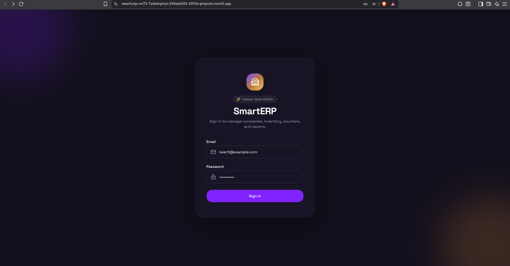
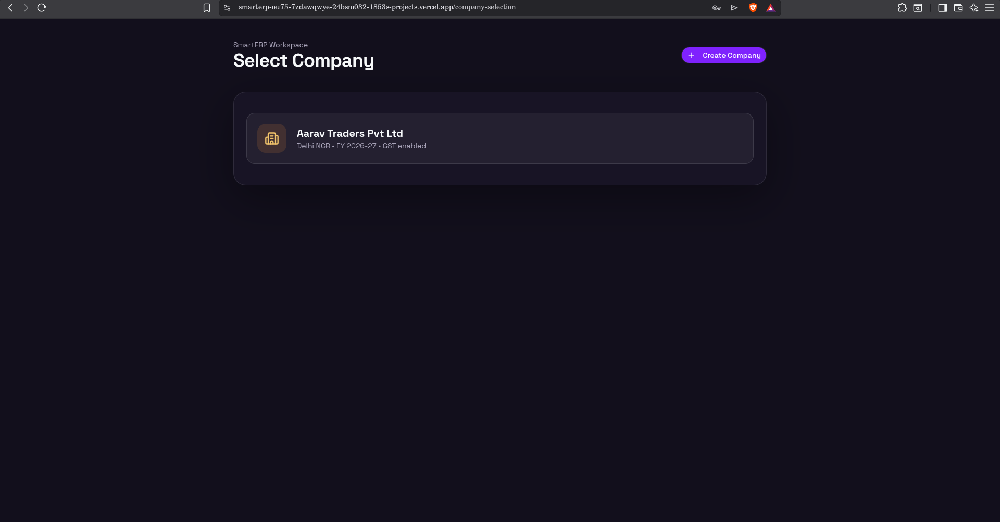
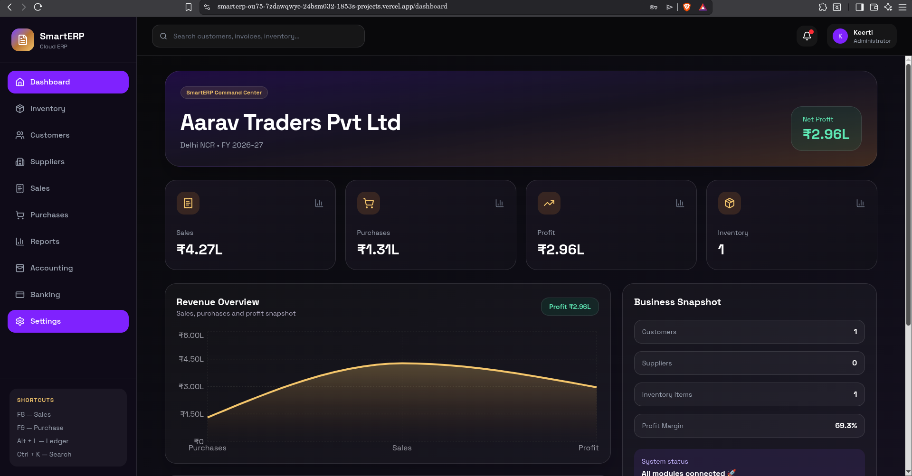
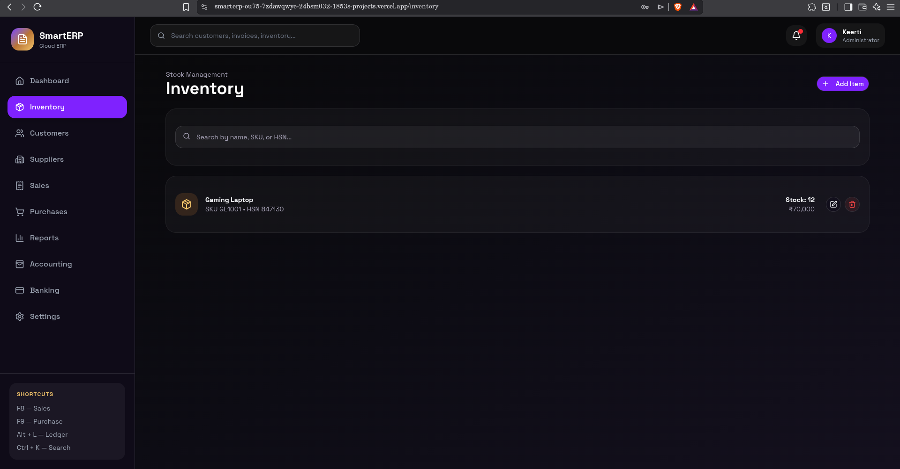
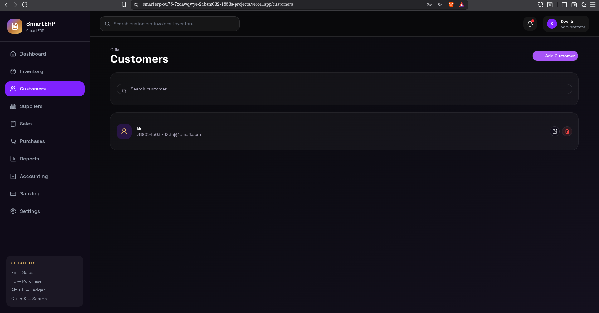
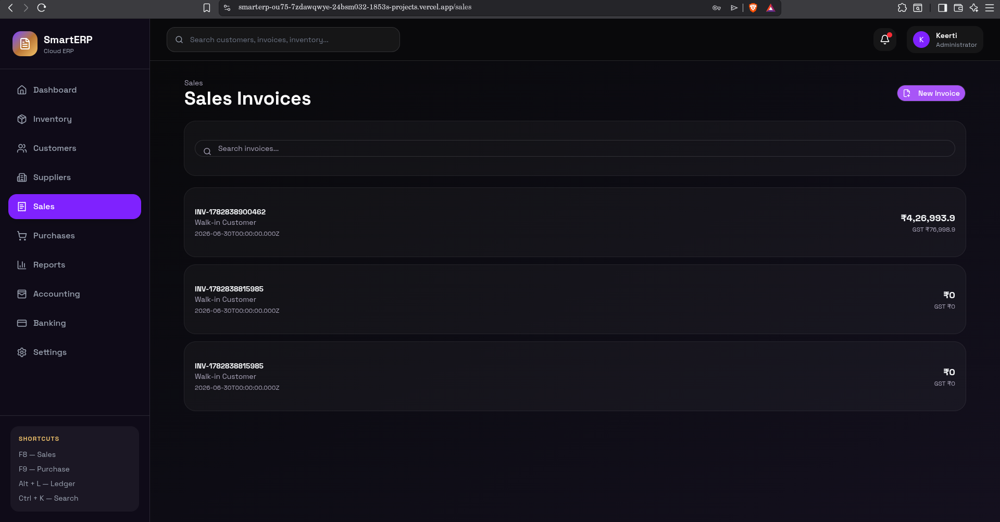
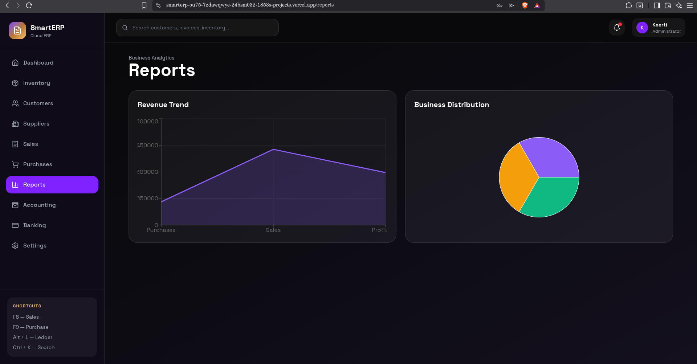

# SmartERP 🚀

SmartERP is a full-stack cloud ERP web application built with Next.js, Express.js, PostgreSQL, and Supabase. It helps small businesses manage companies, inventory, customers, suppliers, sales, purchases, reports, accounting, banking, PDF invoices, and Excel exports from one dashboard.

## Live Demo

Frontend: https://smarterp-ou75.vercel.app  
Backend: https://smarterp-dx08.onrender.com  


## 📸 Screenshots

### Login


### Company Selection


### Dashboard


### Inventory


### Customers


### Sales


### Reports



## Test Login

Email: keerti@example.com  
Password: password123  

## Features

- JWT authentication
- Company selection and management
- Professional analytics dashboard
- Live recent transactions
- Inventory CRUD
- Customer CRUD
- Supplier CRUD
- Sales invoice module
- Purchase invoice module
- Reports dashboard
- Accounting summary
- Banking summary
- PDF invoice generation
- Excel sales export
- PostgreSQL database
- Deployed frontend and backend

## Tech Stack

### Frontend
- Next.js
- TypeScript
- Tailwind CSS
- shadcn/ui
- Recharts
- Vercel

### Backend
- Node.js
- Express.js
- PostgreSQL
- JWT authentication
- PDFKit
- ExcelJS
- Render

### Database
- Supabase PostgreSQL

## Project Structure

```txt
smarterp/
├── client/        # Next.js frontend
├── server/        # Express backend
└── README.md
